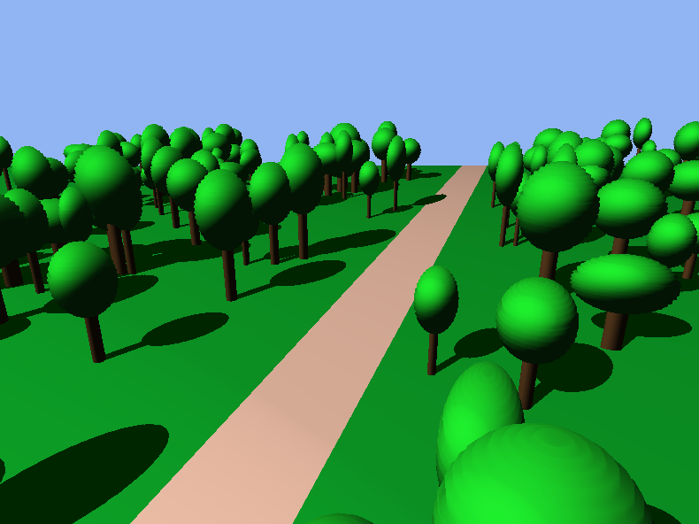

# Graphics framework OpenGL

This is a baseline that contains a lot of functionalities for 3D rendering, from complex 3D shapes, to shadows and lightning, camera movement, and object creation. It can be used as a framework for any graphical project, as the code provided in this repo si easily reusable.

## Screenshots

This is an example of a scene that contains a lot of trees, using the framework we created.



Of course the framework is not limited to only trees, you can create any 3D shapes and put them in a scene using it.

## Pre-requisites

1. [GLUT](https://www.opengl.org/resources/libraries/glut/glut_downloads.php)
2. [GLEW](http://glew.sourceforge.net/)
3. [GLM](https://glm.g-truc.net/0.9.9/)

## How to run
You can use the Makefile to build, run, clean, or all of them.
Simply run one of the following commands
```
make build
make run
make clean
make all
```